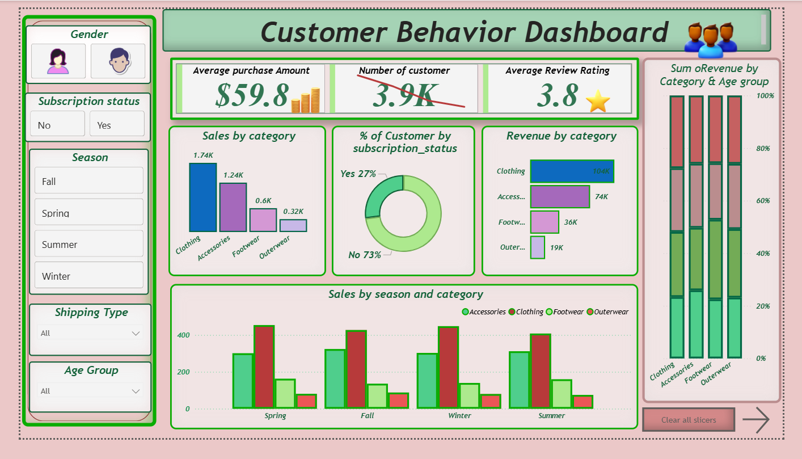
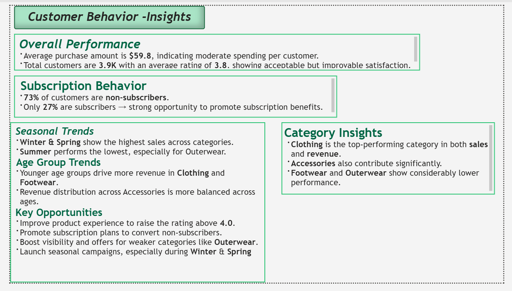

# 📊 Customer Behaviour Analysis  
A complete end-to-end **Customer Behaviour Analysis** project using **Python (Pandas)**, **SQL**, and **Power BI** to uncover insights into purchasing patterns, customer segmentation, and business decision-making trends.

---
## 📸 Power BI Dashboard Snapshot

  
  

---
## 📌 Table of Contents
1. [About the Project](#about-the-project)  
2. [Project Motivation & Goals](#project-motivation--goals)   
3. [Tools & Technologies](#tools--technologies)  
4. [Project Workflow](#project-workflow)  
5. [Key Insights & Findings](#key-insights--findings)  

---

## 📎 About the Project
This project performs an in-depth analysis of customer data to understand purchasing patterns and behaviour. It combines **data cleaning and manipulation using Python (Pandas)**, **data querying with SQL**, and **visualization & dashboarding with Power BI**. The goal is to help stakeholders make data-driven business decisions.

---

## 🎯 Project Motivation & Goals
- Provide actionable insights into **customer purchasing behaviour**.  
- Apply an integrated analytics workflow using industry-relevant tools.  
- Demonstrate skills in **Python, SQL**, and **Power BI** within one project.  
- Build a comprehensive dashboard to visualize patterns and trends.

---

## 🗃 Dataset Overview

| Attribute | Details |
|------------|---------|
| 📄 Total Records | 3,900 rows |
| 🧩 Total Features | 19 columns |
| 🔢 Numerical Variables | 5 continuous features |
| 🏷️ Categorical Variables | 14 categorical features |

---

## 🛠 Tools & Technologies
- **Python (Pandas)** — Data cleaning, preprocessing, exploratory data analysis  
- **SQL (MySQL)** — Data storage, querying, transformation  
- **Power BI** — Interactive dashboard creation  
- **Jupyter Notebook / Scripts** — Code environment

---

## 🔄 Project Workflow
1. **Data Loading & Cleaning (Python)**  
   - Import dataset with Pandas  
   - Handle missing values and duplicates   

2. **Data Storage & Querying (SQL)**  
   - Load cleaned data into SQL database  
   - Write SQL queries to extract business insights  

3. **Visualization & Dashboard (Power BI)**  
   - Upload cleaned data to Power BI  
   - Create interactive visualizations  
   - Build dashboards with filters and key metrics

---

## 📊 Key Insights & Findings
- Top customer segments by revenue  
- Monthly sales performance  
- Average purchase value by category
  
**Revenue**: Gender & age group splits  
**Loyalty**: Subscribers spend more; repeat buyers (>5 purchases) subscribe  
**Products**: Top 5 rated items; top 3 per category  
**Discounts**: Premium discount users; discount-heavy products  
**Shipping**: Express vs Standard spend comparison

---
## 👩‍💻 Author  
**Shahid Ali**  
*Data Analyst*
